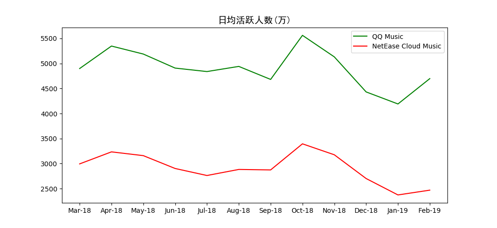
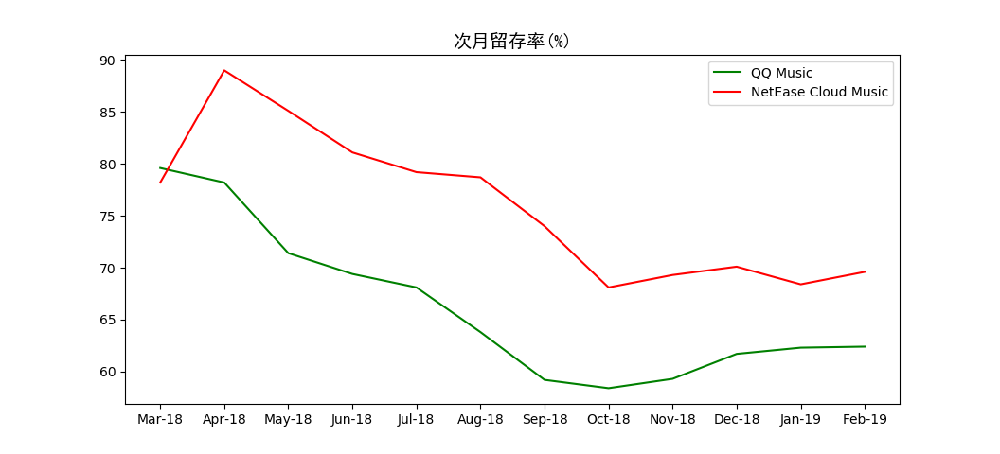
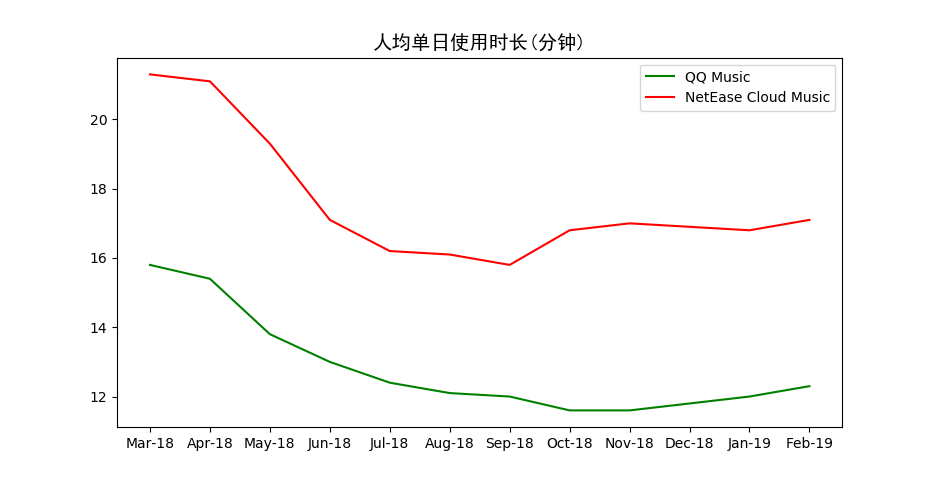

# 竞品分析：网易云音乐与QQ音乐

## 1 分析背景

### 1.1 市场分析

自2004年酷狗音乐问世，截至2013年4月，中国互联网音乐软件市场已成一片红海，QQ音乐、酷狗、酷我等已占据大量的市场份额。然而网易云音乐以一匹黑马的姿态，凭借“音乐社交”的差异点切入市场，并在短短三年内突破2亿用户量。与此同时，活跃用户规模也逐渐从传统的PC端转入移动端。

>  
>
>  来自 中国数字音乐用户行为洞察白皮书2017@易观博阅

根据艾瑞咨询数据显示，2013年到2018年，中国面向用户的移动端数字音乐平台，如 QQ 音乐、网易云等，已经形成以用户付费为主、广告及转授权收入为辅的成熟商业模式。2018 年中国用户端数字音乐平台总收入更是达到 76.3 亿元。中国数字音乐市场的规模在增长，预示着更多的音乐通过数字专辑的方式销售，中国人对于数字音乐的需求也在不断增加。随着市场规模增速趋于稳定，移动音乐客户端市场红利逐渐消退、用户规模增长放缓，数字音乐也正在进入版权资源竞争与凸显差异性的时代。

> 
>
> 来自 艾瑞资讯，《商业化的复兴：2019年中国数字音乐产业研究报告》

### 1.2 研究目的

作为QQ音乐运营，将能够快速积累用户、扩大业务的黑马网易云音乐作为竞品，目的在于了解中国数字音乐市场发展行情，了解和竞品之间的差距，确认新的产品切入点以便改进提升，从而更好地占据市场。

## 2 竞品介绍

▲**网易云音乐**

上线时间：2013年4月。

产品定位：以歌单、DJ节目、社交、地理位置为核心要素，主打发现和分享。

Slogan：音乐的力量（和超6亿有趣的人听歌看评论）。

版本：7.0.20

目标用户：学生及一线白领等为主体的注重音乐品质和分享的音乐爱好者及发烧友。

▲**QQ音乐**

上线时间：2005年2月

产品定位：千万量级的正版乐库，业界领先的播放品质，让您跟随最新最潮的音乐，给您自由探索的空间。

Slogan：让生活充满音乐（十三年的陪伴，国民音乐平台）。

版本：9.8.5.7 

目标用户：以全民覆盖作为目标用户。

## 3 竞品分析

### 3.1 定位和功能分析

#### 3.1.1 用户定位

QQ音乐与网易云音乐都旨在吸引年轻用户，开拓数字音乐市场，抓住年轻用户，即把握市场的未来。

#### 3.1.2 市场定位

#### 3.1.2 产品功能

功能	QQ音乐	网易云音乐

语音搜索 支持	不支持

汉语拼音 支持	不支持

好友动态 不支持	支持

...（一张表格）

也可以画那种思维导图？

### 3.2 设计和技术分析

#### 3.2.1 交互和体验

画流程图

* QQ音乐

  

* 网易云音乐

  

#### 3.2.2 视觉和风格

* QQ音乐

  整体来说，QQ音乐移动端的UI设计简洁而有韵味。最新版9.8.5.7主界面一共有两套风格：默认为皮肤“茶霜白”，绿色简笔图标、白色文字，给人深邃而宁静的感觉。“玄潭黑”则属绿色简笔图标配黑色底色，是营造神秘的优雅的氛围。

  各个块间的分割很好符合了极简风格，避免使用线条分割，减少引起视觉混乱的元素，让用户能将注意力更为集中的放在重点内容上。卡片式的设计让模块逻辑更加清晰，“我的”主要包含本地的下载歌曲以及收藏的在线音乐，“音乐馆”则是寻找官方推荐歌曲、榜单音乐的推荐库；而“发现”则是一些具有特色的附加社交属性功能，诸如好友圈、唱歌等。极简的UI设计，使即使是初次接触的用户，学习成本也十分低微，理解起来毫不费力。

  

* 网易云音乐

  

#### 3.2.3 亮点功能和核心技术

网易：

音乐推荐功能

QQ： 

### 3.3 运营及商业化分析

#### 3.3.1 运营模式

网易：

区别与传统音乐平台的播放器定位，网易云音乐给自己的定位是音乐社区，主打态度和情怀，鼓励用户在评论区分享自己的感受，这些文字也让用户得以与其他的听众产生情感共鸣，获得价值归属感，在互动的过程中形成社区，让听音乐从私密的个人爱好，转变为带有社交目的的行为。

评论区、社区交互，与音乐人、好友互动

鼓励创作，扶持培育原创音乐人，支持独立音乐人的唱片和巡演，设置“硬地原创音乐榜”选拔高质量歌曲

购买热门音乐综艺版权，获得人气引流，如《歌手》等

创新线下营销活动，歌词地铁、热评地铁站，针对乘坐地铁的年轻人群，给通勤场合增添一些心理慰藉。

与品牌跨界合作，开展线下音乐活动。如农夫山泉、Uber等。

QQ：

偶像引流、粉丝打榜、以明星为核心

明星艺人，海量版权，周杰伦《说好不哭》

自制综艺/选秀音源，如《明日之子》、《创造101》

通过腾讯社交软件向好友分享

#### 3.3.2 盈利模式

网易：

收费会员、付费下载包

广告：开屏广告，首页滚动栏，评论区插入广告，

音频直播

数字专辑

演出票务

智能硬件与音乐周边：

 华晨宇数字单曲《好想爱这个世界啊》12月4日上线，到今天，销售额已经突破5800万元，销量突破1960万张，刷新数字单曲全网销量纪录。 

QQ：

付费绿钻会员、付费下载包

广告：开屏广告、mv播放前的贴片广告、浏览界面中的广告栏

数字专辑售卖

#### 3.3.3 市场推广

网易：音乐测试、年度报告等H5互动小程序

QQ：

### 3.4 用户数据分析

#### 3.4.1 用户数量和活跃度

用户总量（来自七麦数据）

日均活跃人数：在所选时间段内，APP平均每天的活跃用户数；期间用户主观打开过至少一次APP，即算活跃用户(来自易观千帆)

#### 3.4.2 用户留存率(易观千帆)

计算方法：留存率=登录用户数/新增用户数*100%

次日留存率：（第一天新增用户数，第2天还登录的用户数）/第一天总注册用户数

#### 3.4.3 人均单日启动次数（易观千帆）

在所选时间段内，APP平均每天被每个用户打开的次数；体现用户黏度

#### 3.4.4 人均单日使用时长（易观千帆）

在所选时间段内，APP平均每天被每个用户使用的时长

#### 3.4.5 地域差异（百度指数）

### 3.5 核心策略分析

#### 3.5.1 版本迭代和演变

#### 3.5.2 战略

网易云音乐：

新推出“因乐交友”的社交功能，具有音图文分享的功能。以音乐吸引用户，以社交留下用户，再将用户导向直播。

QQ：

### 3.6 优缺点总结和借鉴
 SWOT？

## 4 总结

