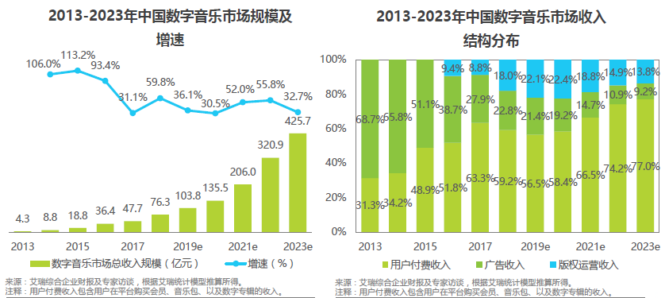

# 竞品分析：网易云音乐与QQ音乐

## 1 分析背景

### 1.1 市场分析

根据艾瑞咨询数据显示，2013年到2018年，中国面向用户的移动端数字音乐平台，如 QQ 音乐、网易云等，已经形成以用户付费为主、广告及转授权收入为辅的成熟商业模式。2018 年中国用户端数字音乐平台总收入更是达到 76.3 亿元。中国数字音乐市场的规模在增长，预示着更多的音乐通过数字专辑的方式销售，中国人对于数字音乐的需求也在不断增加。随着市场规模增速趋于稳定，移动音乐客户端市场红利逐渐消退、用户规模增长放缓，数字音乐也正在进入版权资源竞争与凸显差异性的时代。

> 
>
> 来自 艾瑞资讯，《商业化的复兴：2019年中国数字音乐产业研究报告》

### 1.2 研究目的

自2004年酷狗音乐问世，截至2013年4月，中国互联网音乐软件市场已成一片红海，QQ音乐、酷狗、酷我等已占据大量的市场份额。然而网易云音乐以一匹黑马的姿态，凭借“音乐社交”的差异点切入市场，并在短短三年内突破2亿用户量。与此同时，活跃用户规模也逐渐从传统的PC端转入移动端。

>  
>
>  来自 中国数字音乐用户行为洞察白皮书2017@易观博阅

根据百度指数显示，两款应用的搜索指数整体日均值网易云音乐远高于QQ音乐。QQ音乐整体同比、移动同比和移动环比也在下降，而网易云音乐都在上升。

>
>
>来自 百度指数

对此，作为QQ音乐运营，将能够快速积累用户、扩大业务的黑马网易云音乐作为竞品，目的在于了解中国数字音乐市场发展行情，了解和竞品之间的差距，确认新的产品切入点以便改进提升，从而更好地占据市场。

## 2 竞品介绍

▲**网易云音乐**

上线时间：2013年4月。

产品定位：以歌单、DJ节目、社交、地理位置为核心要素，主打发现和分享。

Slogan：音乐的力量（和超6亿有趣的人听歌看评论）。

版本：7.0.20

目标用户：学生及一线白领等为主体的注重音乐品质和分享的音乐爱好者及发烧友。

▲**QQ音乐**

上线时间：2005年2月

产品定位：千万量级的正版乐库，业界领先的播放品质，让您跟随最新最潮的音乐，给您自由探索的空间。

Slogan：让生活充满音乐（十三年的陪伴，国民音乐平台）。

版本：9.8.5.7 

目标用户：以全民覆盖作为目标用户。

## 3 竞品分析

### 3.1 定位和功能分析

#### 3.1.1 用户定位

QQ音乐与网易云音乐都旨在吸引年轻用户，开拓数字音乐市场，抓住年轻用户，即把握市场的未来。

#### 3.1.2 市场定位

“网易云音乐”是一款依托专业音乐人、DJ、好友推荐及社交功能，在线音乐服务主打歌单、社交、大牌推荐和音乐指纹，以歌单、DJ节目、社交、地理位置为核心要素，主打发现和分享的应用。成立于2013年4月，开发上线运营3个客户端（Android、iOS、PC），并在2015年4月推出了适配iPad的HD版本。

“网易云音乐”用【音乐的力量】将用户、音乐人以及自媒体聚集在它的UGC模块：打造音乐歌单、评论、短视频、电台、动态等用户原创内容，提高用户活跃度，提升购买前后的参与度，为产品变现创建了很多有效通道。

“QQ音乐”创立于2005年,是一款带有精彩音乐推荐功能的播放器。同时支持在线音乐和本地音乐的播放，是国内内容最丰富的音乐平台。其独特的音乐搜索和推荐功能，让您可以尽情地享受最流行，最火爆的音乐。

#### 3.1.2 产品功能

功能	QQ音乐	网易云音乐

语音搜索 支持	不支持

汉语拼音 支持	不支持

好友动态 不支持	支持

...（一张表格）

也可以画那种思维导图？

### 3.2 设计和技术分析

#### 3.2.1 交互和体验

若将优秀交互设计的标准提炼出来，我们可以分为：“可用性”和“创新性”两个标准。

“可用性”标准我们可以参考Luke Miller在《用户体验方法论》中提出的LEMES原则，即：

1. Learnability（易学）
2. Efficiency（高效）
3. Memorability（易记）
4. Errors（纠错）
5. Satisfaction（满意度）

“创新性”标准我们可以参考“[社交产品方法论（四）：需求设计背后的逻辑](http://www.woshipm.com/pd/1340856.html)”一文中提到的“**4整合+1关注**”：

1. 整合竞品优点

2. 整合热门功能

3. 整合多个操作步骤

4. 整合多个用户群

5. 关注细节

   

#### 3.2.2 视觉和风格

* QQ音乐

  整体来说，QQ音乐移动端的UI设计简洁清雅。最新版9.8.5.7主界面一共有两套风格：默认为皮肤“茶霜白”，包括绿色简笔图标和白色底色。“玄潭黑”是绿色简笔图标配黑色底色。走的是文艺起名路线。

  > 
  >
  > QQ音乐的进入动画和初始页面 shot on Lenovo ZUK2 Pro, QQ Music 9.8.5.7

  QQ音乐主界面四个模块内部采用卡片式设计，让模块逻辑更加清晰。“动态”界面采用信息流样式，“推荐”界面注重展现封面图片和推荐语，“音乐馆”界面使用形象的按钮提供多种音乐选项。

  > 
  >
  > “茶霜白”皮肤下QQ音乐的底部导航栏界面一览 shot on Lenovo ZUK2 Pro, QQ Music 9.8.5.7 

* 网易云音乐

  最新版分为默认白和经典红两种，以纯色系为主，简洁明快；不同皮肤在“我的”页面没有区别。在设备首次登陆的皮肤是“默认白”。
  
  >
  >
  >网易云音乐的进入动画和初始页面 shot on Lenovo ZUK2 Pro, 网易云音乐7.0.20
  
  网易云音乐的四个主选项卡下面采用了分级选项卡。音乐视频专栏采用图片封面，形成多媒体流信息的效果。圆角矩形的设计也增强了美感。
  
  >
  >
  >“默认白”皮肤下QQ音乐的底部导航栏界面一览 shot on Lenovo ZUK2 Pro, QQ Music 9.8.5.7 

#### 3.2.3 亮点功能和核心技术

网易：

* 每日推荐/推荐歌单

  区别于私人FM的单曲形式，每日推荐共有20首歌曲，曲风不一，每天06：00更新（选择在线用户最少的时间收集最多的口味数据，让更新后的日推更准）。我们常在歌曲的评论区看见“日推，赞！”或者“日推，沦陷”等评论，说明该功能深受用户喜爱并且所用算法十分精准。用户可在日推列表对歌曲进行批量收藏或下载，也可单独进行操作。

  推荐歌单作为UGC内容由用户创建，可自定义添加标签、封面、歌单名，所含歌曲数随歌单所属用户新增或删除而变动。根据用户口味在首页展示6个推荐歌单，也可点击箭头查看更多歌单，根据风格分类进行筛选，可收藏整个歌单或选择性添加歌曲。

  歌曲推荐功能主要采用协同过滤算法（分为基于用户和基于项目），对用户的历史行为和所收藏歌单风格进行分析，从而推荐高相似度的歌曲给用户，这种算法在数据量足够庞大时显得尤为强大。而对于新用户或者使用网易云音乐频率低的用户（既冷启动问题），基于内容的推荐算法则作为协同过滤算法的补充，以区分单曲内容实质的方式向用户推荐合适的音乐。

* 歌单UGC

  歌单是网易云音乐的核心功能，既是音乐存在形式的载体，也是连接用户与用户的纽带。用户自定义添加标签、自由组合歌曲来创建歌单，赋予其特殊的情绪或理念，呈现给其他用户。不同的人可能因为同一份歌单产生情感上的共鸣，进而发生互动和交流，形成社交环境。

  歌单体现了网易云音乐对**UGC社交属性**的注重和倡导，一份歌单如果被很多人收藏、评论、分享，创建者由此得到的成就感和满足感成为其继续创造的动力，而收听者被调动了情绪也进行创造，从而导致海量优质歌单的产生，形成良好的UGC闭环。

QQ： 

### 3.3 运营及商业化分析

#### 3.3.1 运营模式

网易：

区别与传统音乐平台的播放器定位，网易云音乐给自己的定位是音乐社区，主打态度和情怀，鼓励用户在评论区分享自己的感受，这些文字也让用户得以与其他的听众产生情感共鸣，获得价值归属感，在互动的过程中形成社区，让听音乐从私密的个人爱好，转变为带有社交目的的行为。

评论区、社区交互，与音乐人、好友互动

鼓励创作，扶持培育原创音乐人，支持独立音乐人的唱片和巡演，设置“硬地原创音乐榜”选拔高质量歌曲

购买热门音乐综艺版权，获得人气引流，如《歌手》等

创新线下营销活动，歌词地铁、热评地铁站，针对乘坐地铁的年轻人群，给通勤场合增添一些心理慰藉。

与品牌跨界合作，开展线下音乐活动。如农夫山泉、Uber等。

QQ：

偶像引流、粉丝打榜、以明星为核心

明星艺人，海量版权，周杰伦《说好不哭》

自制综艺/选秀音源，如《明日之子》、《创造101》

通过腾讯社交软件向好友分享

#### 3.3.2 盈利模式

网易：

收费会员、付费下载包

广告：开屏广告，首页滚动栏，评论区插入广告，

音频直播

数字专辑

演出票务

智能硬件与音乐周边：

 华晨宇数字单曲《好想爱这个世界啊》12月4日上线，到今天，销售额已经突破5800万元，销量突破1960万张，刷新数字单曲全网销量纪录。 

QQ：

付费绿钻会员、付费下载包

广告：开屏广告、mv播放前的贴片广告、浏览界面中的广告栏

数字专辑售卖

#### 3.3.3 市场推广

网易：音乐测试、年度报告等H5互动小程序

QQ：

### 3.4 用户数据分析

#### 3.4.1 用户数量和活跃度

用户总量（来自七麦数据）

日均活跃人数：在所选时间段内，APP平均每天的活跃用户数；期间用户主观打开过至少一次APP，即算活跃用户(来自易观千帆)

#### 3.4.2 用户留存率(易观千帆)

计算方法：留存率=登录用户数/新增用户数*100%

次日留存率：（第一天新增用户数，第2天还登录的用户数）/第一天总注册用户数

#### 3.4.3 人均单日启动次数（易观千帆）

在所选时间段内，APP平均每天被每个用户打开的次数；体现用户黏度

#### 3.4.4 人均单日使用时长（易观千帆）

在所选时间段内，APP平均每天被每个用户使用的时长

#### 3.4.5 地域差异（百度指数）

### 3.5 核心策略分析

#### 3.5.1 版本迭代和演变

#### 3.5.2 战略

网易云音乐：

新推出“因乐交友”的社交功能，具有音图文分享的功能。以音乐吸引用户，以社交留下用户，再将用户导向直播。

QQ：

### 3.6 优缺点总结和借鉴
 SWOT？

## 4 总结

