竞品分析：网易云音乐与QQ音乐

## 1 分析背景

### 1.1 市场分析

根据艾瑞咨询数据显示，2013年到2018年，中国面向用户的移动端数字音乐平台，如 QQ 音乐、网易云等，已经形成以用户付费为主、广告及转授权收入为辅的成熟商业模式。2018 年中国用户端数字音乐平台总收入更是达到 76.3 亿元。中国数字音乐市场的规模在增长，预示着更多的音乐通过数字专辑的方式销售，中国人对于数字音乐的需求也在不断增加。随着市场规模增速趋于稳定，移动音乐客户端市场红利逐渐消退、用户规模增长放缓，数字音乐也正在进入版权资源竞争与凸显差异性的时代。

> 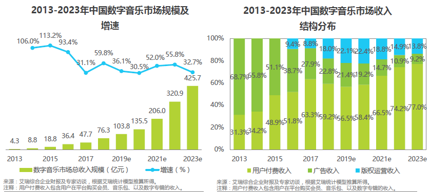
>
> 来自 艾瑞资讯，《商业化的复兴：2019年中国数字音乐产业研究报告》

### 1.2 研究目的

自2004年酷狗音乐问世，截至2013年4月，中国互联网音乐软件市场已成一片红海，QQ音乐、酷狗、酷我等已占据大量的市场份额。然而网易云音乐以一匹黑马的姿态，凭借“音乐社交”的差异点切入市场，并在短短三年内突破2亿用户量。与此同时，活跃用户规模也逐渐从传统的PC端转入移动端。

>  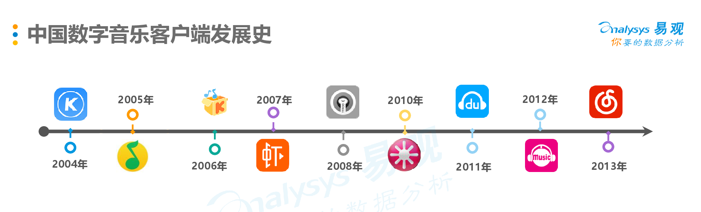
>
>  来自 中国数字音乐用户行为洞察白皮书2017@易观博阅

根据百度指数显示，两款应用的搜索指数整体日均值网易云音乐远高于QQ音乐。QQ音乐整体同比、移动同比和移动环比也在下降，而网易云音乐都在上升。

>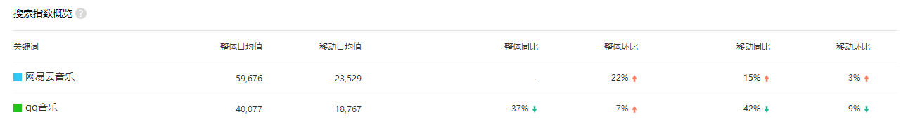
>
>来自 百度指数

对此，作为QQ音乐运营，将能够快速积累用户、扩大业务的黑马网易云音乐作为竞品，目的在于了解中国数字音乐市场发展行情，了解和竞品之间的差距，确认新的产品切入点以便改进提升，从而更好地占据市场。

## 2 竞品介绍

>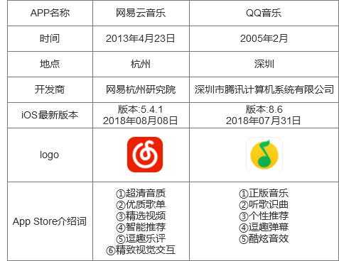
>
>竞品介绍

## 3 竞品分析

### 3.1 定位和功能分析

#### 3.1.1 用户定位

QQ音乐与网易云音乐都旨在吸引年轻用户，开拓数字音乐市场，抓住年轻用户，即把握市场的未来。

#### 3.1.2 市场定位

“网易云音乐”进入市场以小众音乐为切入点，并且积极构建用户社区，将用户、音乐人以及自媒体聚集在它的UGC模块：打造音乐歌单、评论、短视频、电台、动态等用户原创内容，提高用户活跃度，提升购买前后的参与度，为产品变现创建了很多有效通道。

“QQ音乐”拥有更加丰富的曲库和独家的版权，至今仍是国内内容最丰富的音乐平台。因为腾讯家族的原因，也很容易和全民K歌、QQ、微信等APP联动推广、占据市场。

#### 3.1.2 产品功能

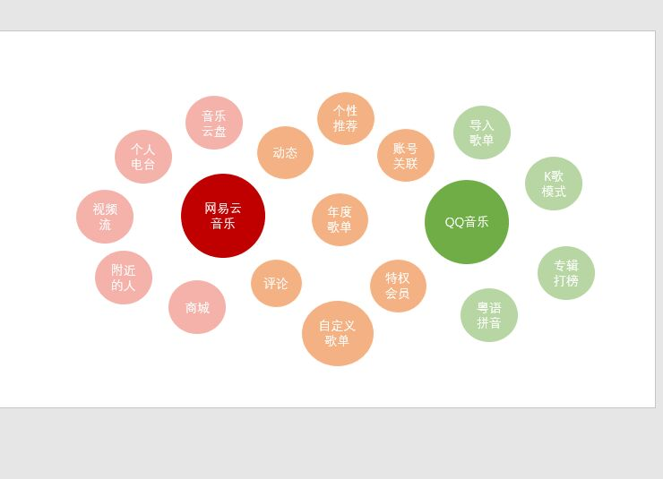

### 3.2 设计和技术分析

#### 3.2.1 交互和体验

**播放音乐**

> 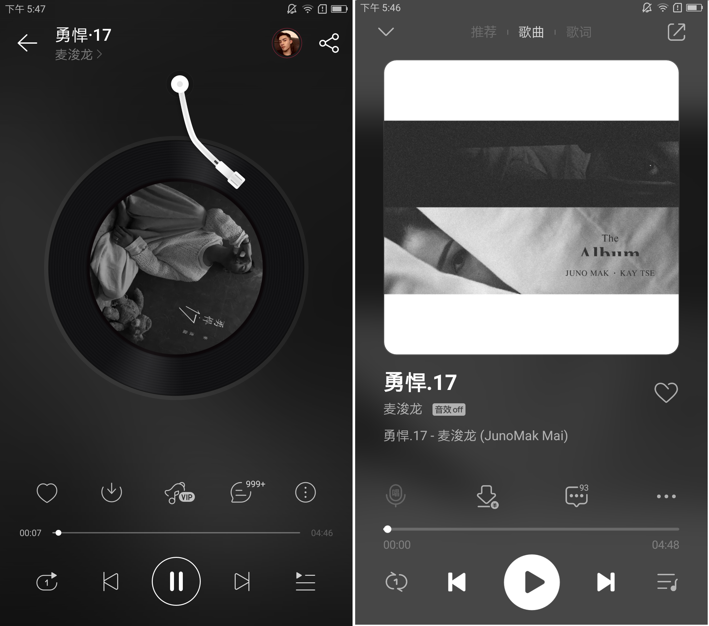
>
> 听歌界面 左：网易云音乐；右：QQ音乐

QQ音乐的播放页面功能太多，上下排布；弹幕、评论区等选项太多，容易造成用户的困扰。

网易云音乐功能较少，水平排布。

**阅读评论**

> 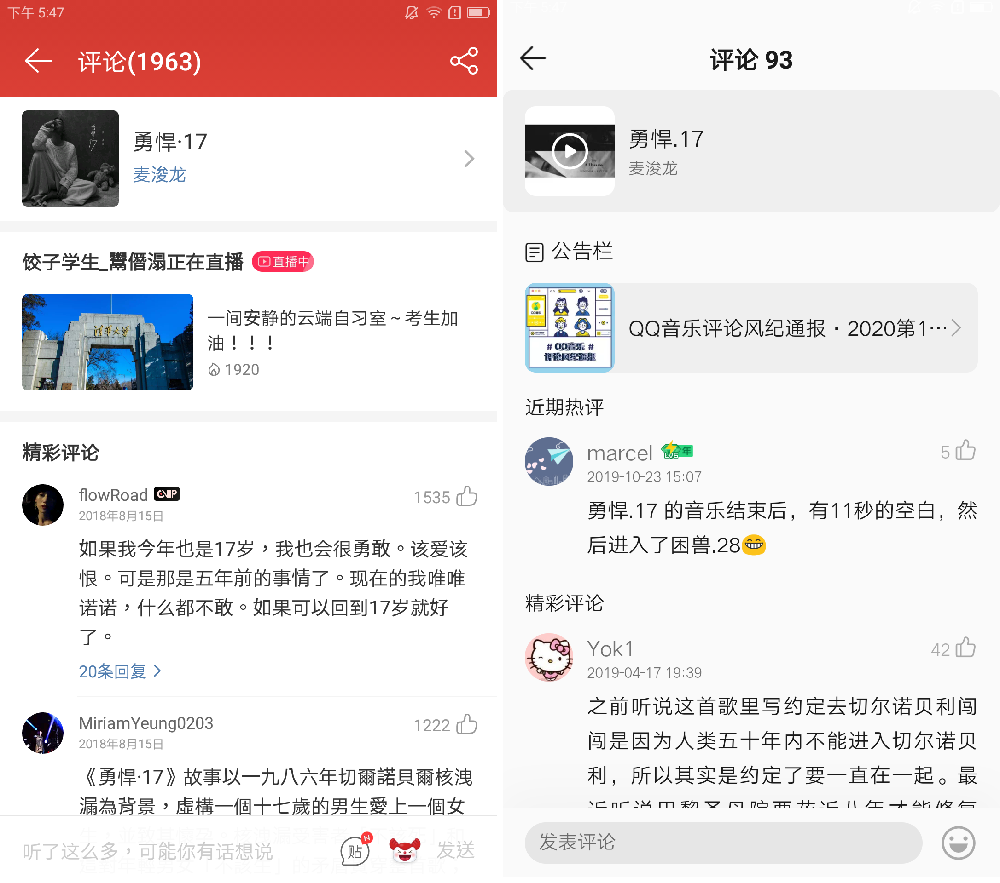
>
> 评论区界面对比 左：网易云音乐；右：QQ音乐

QQ音乐评论类似贴吧，有公告栏，热评和精彩评论。

网易云音乐有更多贴图选择，并且评论区植入直播广告。网易云支持播放界面下拉进入评论区，更加便捷高效。

**查看动态**

QQ音乐：

* “动态”界面采用和微信动态相似的信息流样式，易学；
* “推荐”界面注重展现封面图片和推荐语，也可以选择关闭推荐，更加个性化；
* “音乐馆”会有关注的音乐人的动态信息提示，只有进入页面才有提示，不会给用户带来过多提示消息。

> 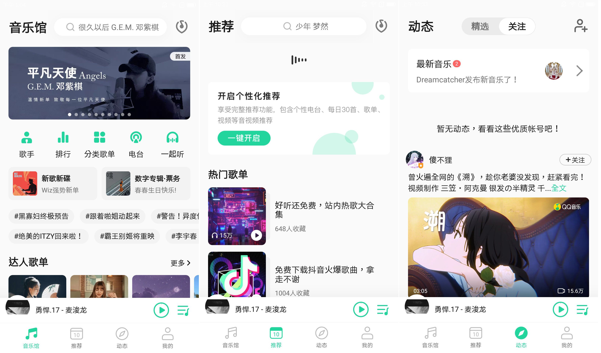
>
> “茶霜白”皮肤下QQ音乐的底部导航栏界面一览 shot on Lenovo ZUK2 Pro, QQ Music 9.8.5.7 

网易云音乐

* “云村”和“视频”采用分级选项卡，层次清晰更高效；

* 界面内部形成了多媒体流信息的效果，视频观感更佳。

>
>
>“默认白”皮肤下QQ音乐的底部导航栏界面一览 shot on Lenovo ZUK2 Pro, QQ Music 9.8.5.7 

#### 3.2.2 视觉和风格

* QQ音乐

  整体来说，QQ音乐移动端的UI设计简洁清雅。最新版9.8.5.7主界面一共有两套风格：默认为皮肤“茶霜白”，包括绿色简笔图标和白色底色。“玄潭黑”是绿色简笔图标配黑色底色。走的是文艺起名路线。

  > 
  >
  > QQ音乐的进入动画和初始页面 shot on Lenovo ZUK2 Pro, QQ Music 9.8.5.7

  

* 网易云音乐

  最新版分为默认白和经典红两种，以纯色系为主，简洁明快；不同皮肤在“我的”页面没有区别。在设备首次登陆的皮肤是“默认白”。
  
  >
  >
  >网易云音乐的进入动画和初始页面 shot on Lenovo ZUK2 Pro, 网易云音乐7.0.20
  
  

#### 3.2.3 亮点功能和核心技术

网易：

* 歌单UGC

  歌单是网易云音乐的核心功能，既是音乐存在形式的载体，也是连接用户与用户的纽带。用户自定义添加标签、自由组合歌曲来创建歌单，赋予其特殊的情绪或理念，呈现给其他用户。不同的人可能因为同一份歌单产生情感上的共鸣，进而发生互动和交流，形成社交环境。

  歌单体现了网易云音乐对**UGC社交属性**的注重和倡导，一份歌单如果被很多人收藏、评论、分享，创建者由此得到的成就感和满足感成为其继续创造的动力，而收听者被调动了情绪也进行创造，从而导致海量优质歌单的产生，形成良好的UGC闭环。
  
* 推荐算法最强？？

QQ： 

* 联合腾讯旗下社交软件（QQ）开展“一起听歌”互动

  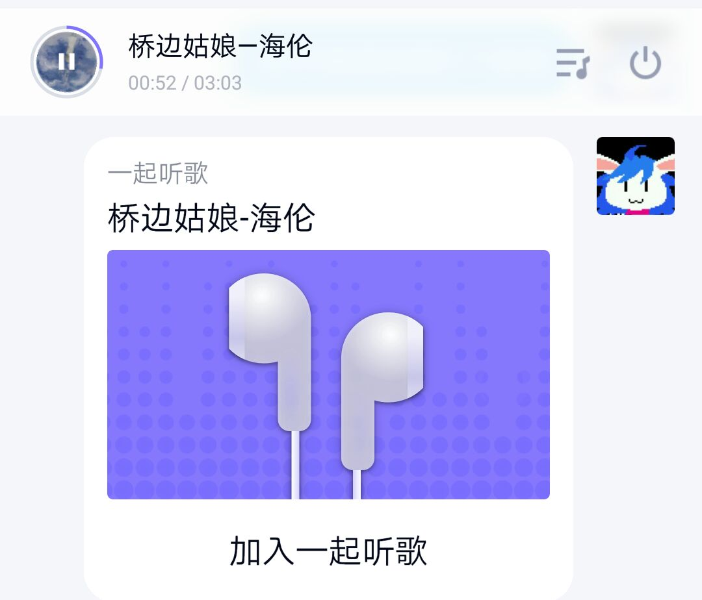

* 听歌识曲算法最强？

### 3.3 运营及商业化分析

#### 3.3.1 运营模式

##### 3.3.1.1 内容运营

网易：

**购买热门音乐综艺版权**，得到人气引流，如《歌手》等，并且在软件首页进行宣传。

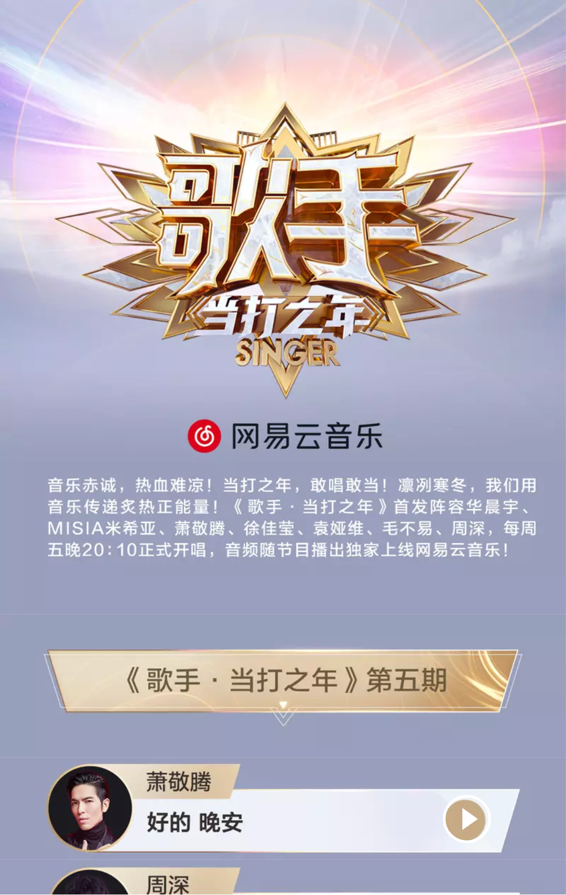

**扶持原创音乐**，支持独立音乐人发布自己的创作

> 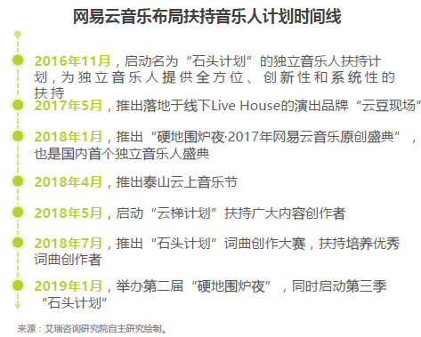
>
> 来源

**鼓励用户自主创作UGC内容**，如歌单、评论与电台

QQ：

QQ音乐的运营核心为音乐版权，以庞大的曲库和独家版权为优势，形成数字唱片版权+综艺音乐版权+腾讯社交平台的运营方式。

**明星艺人，海量版权**，周杰伦《说好不哭》，蔡徐坤《YOUNG》

**自制综艺/选秀音源**，如《明日之子》、《创造101》

**热门影视音乐的独家版权**，《无羁》《凉凉》《知否知否》

陈情令 国风音乐专辑》除了邀请主演肖战、王一博演唱，还联手周笔畅、阿云嘎、周深、王菊、高秋梓等多个圈层的音乐人进行合作，对歌曲进行多维度诠释和传播。《陈情令 国风音乐专辑》歌曲内容与剧情设计具有内在的一致性，人物曲随着剧情节奏分批上线，实现了音乐和剧情在传播上的互相反哺，推动了用户在音乐与影视之间的流通、转化。

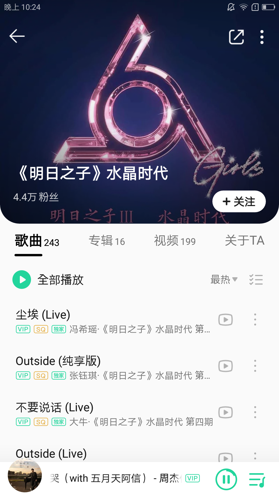

##### 3.3.1.2 用户运营

网易：

区别与传统音乐平台的播放器定位，网易云音乐给自己的定位是音乐社区，主打态度和情怀，鼓励用户在评论区分享自己的感受，这些文字也让用户得以与其他的听众产生情感共鸣，获得价值归属感，在互动的过程中形成社区，让听音乐从私密的个人爱好，转变为带有社交目的的行为。

评论区、**社区交互**，与音乐人、好友互动

> 
>
> 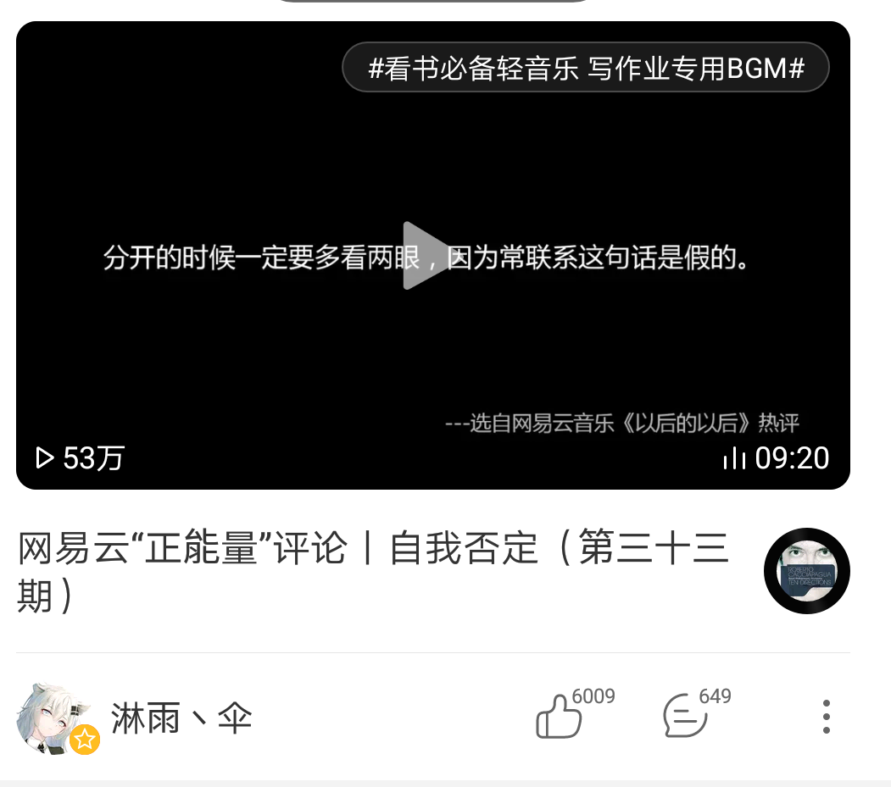

**H5互动小程序**，如音乐测试、年度报告等，根据用户的行为数据分析，将软件的

QQ：

**偶像引流、粉丝打榜**，以明星为核心的粉丝生态圈

**通过腾讯系软件分享音乐**，QQ音乐背靠腾讯的社交网络，提供各种音乐分享传播的渠道，也为音乐社交提供平台

##### 3.3.1.3 活动运营

网易：

设置“**硬地原创音乐榜**”选拔高质量音乐，扶持培育原创音乐人。设置榜单既是对音乐人的鼓励，也是对用户的价值引导

**支持独立音乐人巡演** 主办朴树的

**“云村卧室音乐节**”：针对特殊疫情而举办，让表演者与观众足不出户的云音乐节

 网易云音乐推出“就在卧室音乐节”，以录播+直播为主，从2月11日到2月15日，有32位音乐人连续5场直播演出，在2月18日到2月22日，又继续推出“云村卧室音乐节”，继续邀请28组音乐人，6场连续直播演出。 

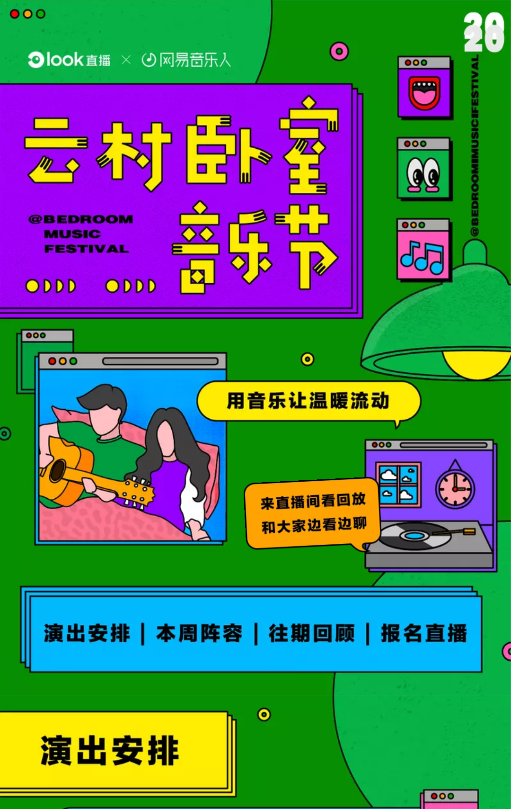

创新线下营销活动，歌词地铁、热评地铁站，针对乘坐地铁的年轻人群，给通勤场合增添一些心理慰藉。

QQ：

QQ音乐与敦煌研究院在音乐模块深入合作，首先推出**古乐重声觉计划**，定下年轻潮的调性，“觉＂在其中既代表敦煌古音乐文化“觉醒”，也表示想通过本次合作计划刺激年轻大众的听觉＆视觉，使其充分感受到敦煌音乐的重生，更是通过多维度方式来觉醒敦煌音乐文化元素。随后举办“古曲新创大赛、梳理敦煌古曲歌单、邀请音乐人为敦煌量身打造新歌，以及在敦煌莫高窟景区举办古乐重声音乐会，最大化地活化敦煌传统音乐文化。

**Q音乐×故宫博物馆《古画会唱歌》**

2018年，由故宫博物院、Next Idea腾讯创新大赛、QQ音乐三方联合打造的“古画会唱歌”音乐创新大赛全新文创项目引起社会关注，方文山作词、张亚东作曲、易烊千玺演唱的大赛的主题曲《丹青千里》瞬间刷屏。故宫首次对外公开了十一幅典藏的千年古画作为本次音乐大赛的创作灵感，参赛选手们为千年古画创作音乐作品，通过以现代音乐“活化”传统文化的创新方式，无数年轻的音乐人基于此，从画中汲取灵感，以现代音乐重新解读创作，让古画在他们的音乐才华中重获新生，在年轻人中迅速“圈粉”，通过活动，全球首张博物院和用户共创的数字音乐专辑《古画会唱歌》正式上线QQ音乐，传统文化也可以很“好听”。

 2018 年 12 月底到 2019 年年初，腾讯视频**"烎· 2019 潮音发布夜**"的预热就已经铺天盖地。从艺人阵容上来说，"烎· 2019 潮音发布夜"汇聚了李宇春、华晨宇、吴亦凡、王源等众多一线歌手以及多位在艺术领域知名的艺术家。此外，活动将艺人与艺术家的跨界合作作为重点突出，为每一位跨界合作的艺人和艺术家制作了单独的视觉海报。

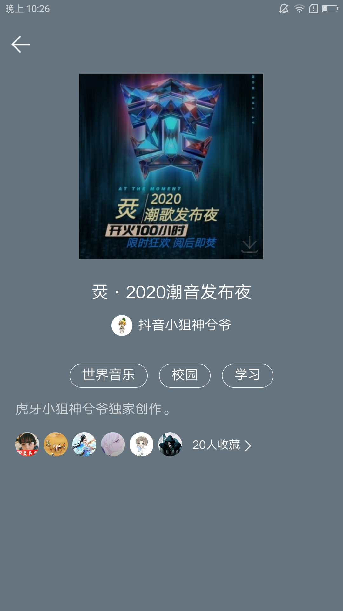

 2019年7 月 8 日，影视音乐数字专辑《陈情令 国风音乐专辑》正式上线腾讯音乐三大平台。上线当天，腾讯音乐娱乐官方微博发起"陈情令以曲会友"的**古风乐器翻奏视频征集活动**，粉丝将《陈情令》主题曲《无羁》演绎出了古琴、二胡、琵琶、古筝等多个版本，引发了二次传播。

2020年1月2日下午消息， 哔哩哔哩(以下简称“B站”)与QQ音乐联合宣布达成深度战略合作，双方表示，将在音乐人扶持、优质音乐推广及资源共享等方面为音乐人开启双平台直通车模式，共同扶持优质音乐人及音乐作品。

 

 

　　据介绍，此次合作将首先打通双方平台的优质音乐内容创作者资源，全面开放音乐人的认证及入驻，并给予双平台的资源扶持。在此基础上，B站还将与QQ音乐共同举办一系列联合线上活动，为创作者打造多支MV，并邀请知名音乐人为作品进行重新编曲，制作专辑。其中，首期音乐创作线上征集活动“**干杯计划**”将于1月6日在双平台上启动。

　　此外，双方还将于后续开启多场线下交流会和演唱会，为音乐人提供更多的专业培训及线下演出机会。

#### 3.3.2 盈利模式

网易：

付费会员：提供高质量音乐播放与下载特权

付费下载包，提供每月定量的音乐下载服务

广告：开屏广告，首页滚动栏，评论区插入广告，

音频直播：观众打赏的平台抽成

数字专辑销售：独家版权的专辑发布&销售

 华晨宇数字单曲《好想爱这个世界啊》12月4日上线，到今天，销售额已经突破5800万元，销量突破1960万张，刷新数字单曲全网销量纪录。 

演出票务：

商城：销售智能硬件与音乐周边，

QQ：

付费绿钻会员 ，享有腾讯音乐游戏的特权活动，腾讯软件中与音乐相关的特权功能。

付费下载包，针对会员曲库的300首/月的下载

数字专辑销售，《说好不哭》

广告：开屏广告、mv播放页面的广告、浏览界面中的广告栏

#### 3.3.3 市场推广

网易：

促销推广

与其他视频平台如优酷，提供捆绑年卡/月卡的优惠价格

**网易云音乐联合YHOUSE，推出全新服务订阅**

2018年7月11日，网易云音乐联合YHOUSE推出了一项全新订阅服务，当网易云音乐平台用户付费升级为“黑胶VIP”用户时，只要再付0.1元，就可以领取由YHOUSE提供的价值1千元的美食+咖啡+鲜花+专车特权的福利券。

YHOUSE成立于2013年，是集美食与休闲娱乐于一体的电商应用，目前已有7万多家精选生活服务商户入驻。对于时下年轻群体来说，美食、音乐、休闲娱乐等逐渐成为生活中必不可少的一部分，这样的跨界营销也能够满足用户的消费需求。

品牌推广

与品牌跨界合作，开展线下音乐活动，如Uber等。

***网易云音乐×屈臣氏线下门店\***

2018年网易云音乐（以下简称“云音乐”）与屈臣氏进行跨界合作，携手探索会员业务。活动中云音乐与屈臣氏联手发布了6款以音乐为灵感的妆容：复古爵士装、民谣诗意妆、流行风尚妆、轻音夏日妆、嘻哈迷幻妆、古风国色妆，并专门搭建了联合展柜与美妆柜台，推出“出道挑战”事件，布置了实景的“出道摄影棚”。在店内搭建上妆拍照体验区，以智能化音箱、化妆镜实现音乐文化赋能线下场景。

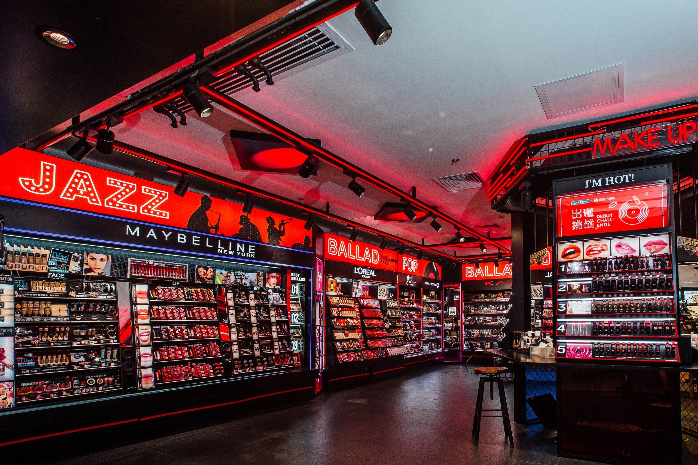

产品推广

和其他品牌联合推广，如在农夫山泉矿泉水瓶上设计黑胶碟片并配有歌词。

QQ：

促销推广

与优酷、bilibili、爱奇艺联合会员优惠，且与腾讯旗下的腾讯视频、腾讯体育、QQ超级会员有捆绑销售优惠，并针对新用户设置更低的专享价格

品牌推广

**腾讯音娱联合瑞幸咖啡，推出世界杯系列活动**

2018年9月6日，此次名为“‘音’你而来加’杯’精彩”的活动以世界杯为主题，腾讯音娱与瑞幸咖啡联合推出了7款联名杯套。杯套文案如“确认过泪痕，是pick同一球队的人”、“一场恋爱一场梦，一场球赛一场痛”等均是由歌词改编而来，同时表达了球迷心声。此外，双方也在QQ音乐上推出了世界杯联名歌单。

　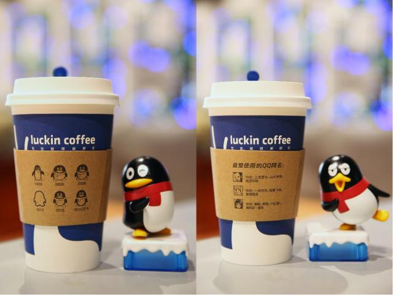

 7 月 8 日，影视音乐数字专辑《陈情令 国风音乐专辑》正式上线腾讯音乐三大平台。此外，《陈情令》还在南京举办演唱会，捆绑数字专辑进行门票抽奖，将线上流量引流到线下。

产品推广：

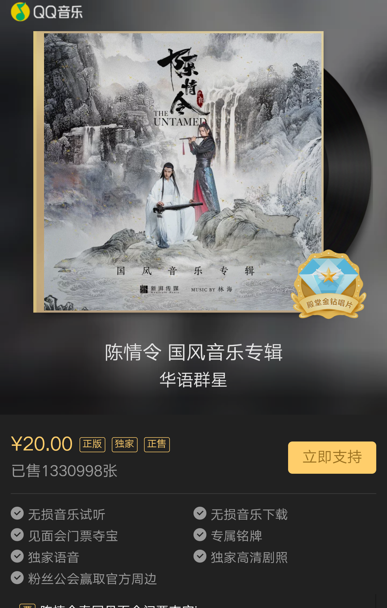

**声纹互动**

Q音乐的声音新玩法其中的一个成功案例是QQ音乐和汉堡王的品牌合作。在春节期间，QQ音乐用户可以通过对着app简单说出一句口令（比如新年来汉堡王）之后，系统会自动匹配一位与该用户声音最近似的歌星，也就是解锁出用户的大咖人设，并同时定制适合用户声音的牛运歌单。

另一个成功案例是QQ音乐和阿玛尼美妆共同推出的"PICK你的新年开运歌单”，玩法类似，只是需要用户先录制一段新年愿望，系统通过“明星嗓音”音色识别所录制的新年愿望，来测试你像哪个明星并生成新年开运歌单。

### 3.4 用户数据分析

#### 3.4.1 用户数量和活跃度

用户总量（来自七麦数据）

日均活跃人数：在所选时间段内，APP平均每天的活跃用户数；期间用户主观打开过至少一次APP，即算活跃用户(来自易观千帆)

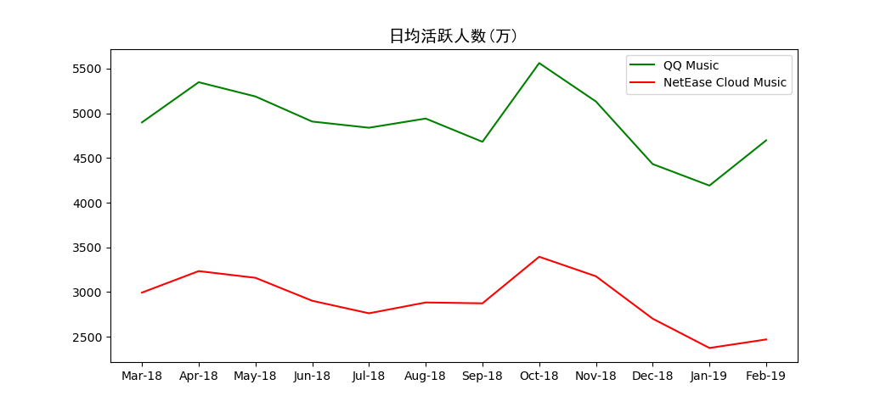

#### 3.4.2 用户留存率(易观千帆)

计算方法：留存率=登录用户数/新增用户数*100%

次日留存率：（第一天新增用户数，第2天还登录的用户数）/第一天总注册用户数

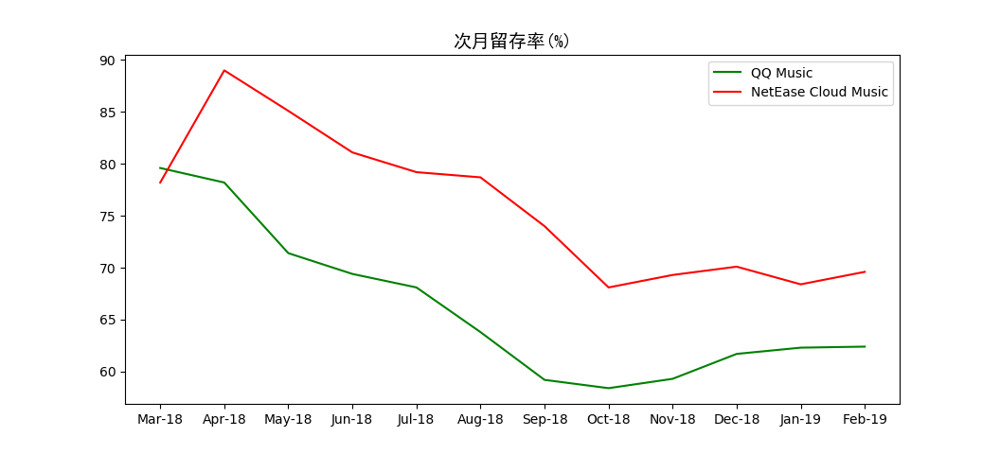

#### 3.4.3 人均单日启动次数（易观千帆）

在所选时间段内，APP平均每天被每个用户打开的次数；体现用户黏度

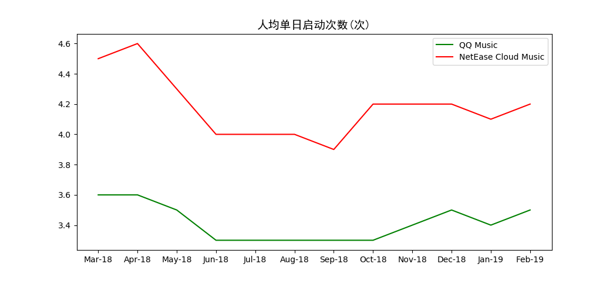

#### 3.4.4 人均单日使用时长（易观千帆）

在所选时间段内，APP平均每天被每个用户使用的时长

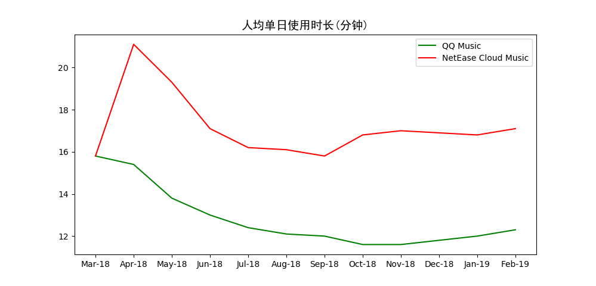

#### 3.4.5 地域差异（百度指数）

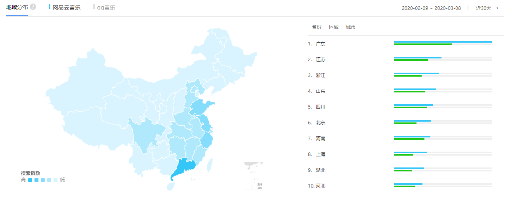

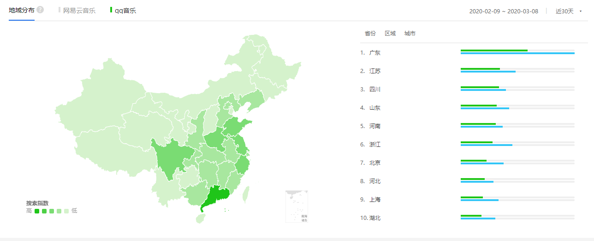

### 3.5 核心策略分析

#### 3.5.1 版本迭代和演变

网易云音乐

1)	探索期——用MVP探索产品形式的可能性

2)	积累期——完善基本的听歌和社交功能，留住核心用户

3)	发展期——稳定促进用户量增长，重点维护产品内的社交氛围

4)	一次爆发增长——由运营手段强力驱动的爆发式增长

5)	后爆发期——爆发后至今的阶段

作者：野猪
链接：https://www.jianshu.com/p/3a7fb7a3d091
来源：简书
著作权归作者所有。商业转载请联系作者获得授权，非商业转载请注明出处。

QQ音乐

#### 3.5.2 战略

网易云策略：

* 激活新用户
  * 优质推荐、活动联力、独家版权
  * 低门槛注册登陆
* 新用户变成老用户
  * 自定义歌单
  * 关注音乐人&认识的人
  * 个性化推荐

* 老用户持久化
  * 提高用户登入频率（云音乐商城的签到得积分+积分兑换商城体系，『激励』用户每日签到）
  * 连续包月会员的优惠
  * 促进用户在平台上产出（翻译歌词、评论区故事、歌单社区、动态分享）
* 流失用户召回
  * 热门推荐、活动联力、独家版权

网易云音乐新推出“因乐交友”的社交功能，具有音图文分享的功能。以音乐吸引用户，以社交留下用户，再将用户导向直播。

### 3.6 优缺点总结和借鉴

* 借鉴用户流路径

QQ音乐因为已经有腾讯旗下其他软件提供了社交基础，在音乐APP内开展互动社区意义不大。网易云相对没有这种社交基础。网易云音乐新推出“因乐交友”的社交功能，具有音图文分享的功能。以音乐吸引用户，以社交留下用户，再将用户导向直播。比起音乐社区形式，QQ音乐更可以借鉴这种用户流路径，从社交用户到音乐用户到直播用户。

* 把握腾讯大家族

QQ音乐的用户也是腾讯的用户，在腾讯各种方面的APP无孔不入地渗透人们生活的时候，QQ音乐可以利用这个机会“和平演变”占领人们的音乐世界。

## 4 总结

* 中国数字音乐市场正在进入版权资源竞争与凸显差异性的时代。网易云音乐这匹黑马通过抓住小众口味、积极维护社用户成为了我们QQ音乐十足的竞品。
* 网易云音乐和QQ音乐都旨在吸引年轻用户，开拓数字音乐市场，抓住年轻用户，即把握市场的未来。网易云的社区氛围和营销手段很好地抓住了年轻人的取向，并且不断地扩展着音乐相关业务。
* 设计方面，和文艺的QQ音乐比起来，网易云音乐更加的简洁、重点突出。技术方面，网易云始终把云计算能力专注听歌识曲，并且衍生出哼唱识曲。
* 运营方面，
* 从用户数据分析可以看出，虽然QQ音乐用户基数大、地域分布广，但是网易云音乐能保持更好的用户黏度。
* 核心策略方面，网易云音乐一直在合理拓展运营手段、开拓音乐人市场、维护小众音乐，并且创造了更多元化的运营手段。网易云音乐也坚持着推荐和听歌识曲算法来维持用户。QQ音乐得益于庞大的腾讯集团，不必依托于社区就可以在旗下的社交软件等推广QQ音乐本身。其优质的推荐算法和丰富的内容也有很好的用户吸引力。
* 根据以上分析，我们的优点在于...，缺点在于传统的音乐APP模式可能不能很好应对新时代的流量竞争。随着网络的便利，自由创作者增多也会吸引更多用户到可以听到自由唱作人的地方；流媒体的大火，也会影响用户使用音乐APP的习惯。把握版权优势，维护服务的质量而不是数量，保证用户的个性化体验，才能在风起云涌的移动数字音乐市场屹立不倒。

